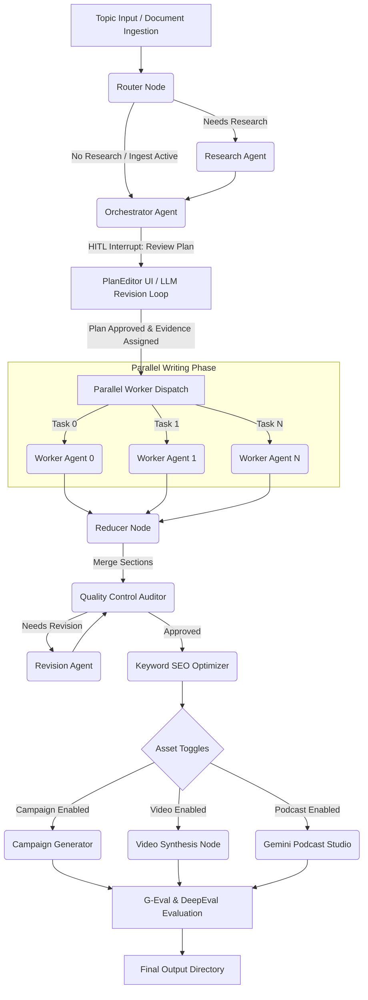

# 🚀 AI Content Factory: Stateful Multi-Agent Content Orchestration & Evaluation Engine
## 🎓 Final Year Project (FYP) — Core System Documentation

[](https://www.python.org/)
[](https://langchain-ai.github.io/langgraph/)
[](https://fastapi.tiangolo.com/)
[](https://react.dev/)
[](https://deepmind.google/technologies/gemini/)
[](https://github.com/confident-ai/deepeval)
[](LICENSE)

A production-ready, stateful, multi-agent AI system designed for automated research, content synthesis, multi-modal asset generation, and academic-grade evaluation. Built on top of **LangGraph**, **FastAPI**, and **React**, this project serves as a **Final Year Project (FYP)** demonstrating state-of-the-art agent coordination, parallel processing, Human-in-the-Loop (HITL) workflows, Advanced RAG, and automated LLM-as-judge quality assessment.

---

## 🌟 Key Capabilities & Research Pillars

1. **Stateful Graph Orchestration:** Manages complex agent communications, loops, and conditions with [LangGraph](https://langchain-ai.github.io/langgraph/).
2. **Stateful Resumption & Checkpointer:** Employs [LangGraph's SqliteSaver](https://langchain-ai.github.io/langgraph/reference/checkpoints/) to persist state. If the process is halted or the server crashes, the engine can resume execution from the exact last saved step without repeating expensive LLM calls or research operations.
3. **Advanced Document Ingestion (Advanced RAG):** Parses PDFs, DOCX, TXT, and Markdown files. Uses sentence-level embeddings (`text-embedding-3-small`) to construct semantic chunks based on similarity thresholds. It executes cosine-similarity queries to match sections and pull targeted, grounded evidence.
4. **Human-in-the-Loop (HITL) Outline Control:** Pauses the writing process to present a draft outline plan to the user. The user can directly modify titles, goals, word counts, and bullet points via the UI, or write natural language feedback to request the LLM to automatically regenerate the plan.
5. **Parallelized Fan-Out Generation:** Speeds up content generation by writing body sections in parallel. Individual Worker agents are assigned specific sections, receiving only the evidence records matching their topic to prevent redundant text or source-stuffing.
6. **Multi-Modal Generation Studio:**
   - **Gemini Podcast Studio:** Synthesizes conversational, solo podcasts using Gemini 2.5 Flash's native audio capabilities, maintaining natural human pacing and speech elements.
   - **Video Generator:** Generates text-to-speech voiceovers, fetches stock B-roll clips from the Pexels API, matches them to the script, and renders videos with synchronized subtitles using MoviePy.
   - **SEO Keyword Optimizer:** Strategically integrates target keywords into headers, body paragraphs, and meta descriptions.
7. **Academic Evaluation (LLM-as-Judge):** Grades content against academic standards across four dimensions: Coherence, Relevance, Accuracy & Grounding, and Tone Alignment, using both in-house scoring and official [DeepEval](https://github.com/confident-ai/deepeval) GEval metrics.

---

## 📐 System Architecture

The workflow is managed as a stateful, interruptible directed acyclic graph (DAG):



---

## 🤖 The Agent Roster

| Agent Node | Core LLM Model | Code Implementation | Primary Responsibility & Logic |
| :--- | :--- | :--- | :--- |
| **Topic Guard** | `gpt-4o-mini` | [topic_guard.py](topic_guard.py) | Sanitizes topic inputs, flags unsafe topics, and recommends corrections before running the graph. |
| **Router** | `gpt-4o-mini` | [routing.py](routing.py) | Analyzes the prompt and decides whether to fetch online research via Tavily or use a closed-book generation approach. |
| **Researcher** | `gpt-4o-mini` + Tavily | [research.py](research.py) | Generates query strings, scrapes web search results, and parses findings into structured evidence. |
| **Ingest / RAG** | `text-embedding-3-small` | [document_ingest.py](document_ingest.py) | Performs semantic chunking and embedding generation on user documents. Dynamically retrieves relevant chunks for grounding. |
| **Orchestrator** | `gpt-4o-mini` | [orchestrator.py](orchestrator.py) | Creates the global blog structure and assigns evidence records to matching sections. |
| **Worker (xN)** | `gpt-4o-mini` | [workers.py](workers.py) | Writes assigned sections in parallel. |
| **Reducer** | `gpt-4o-mini` | [workers.py](workers.py) | Combines sections and identifies paragraph locations for image placements. |
| **Quality Control** | `gpt-4o-mini` | [quality_control.py](quality_control.py) | Compares the blog draft against evidence, flagging inaccuracies or logical gaps. |
| **Revision** | `gpt-4o-mini` | [revision.py](frevision.py) | Revises drafts to address issues raised by the Quality Control agent. |
| **SEO Optimizer** | `gpt-4o-mini` | [keyword_optimizer.py](keyword_optimizer.py) | Integrates target keywords naturally into headers and body text. |
| **Campaign Gen** | `gpt-4o-mini` | [campaign.py](campaign.py) | Creates promotional materials like emails, landing pages, LinkedIn posts, and Twitter threads. |
| **Podcast Studio** | `Gemini 2.5 Flash` | [podcast_studio.py](podcast_studio.py) | Generates a 2-3 minute audio podcast discussing the post using Gemini's native audio modality. |
| **Video Gen** | `gpt-4o-mini` + MoviePy | [video.py](video.py) | Creates an MP4 video complete with stock footage, text-to-speech audio, and synchronized captions. |
| **Academic Judge** | `gpt-4o` + `deepeval` | [evaluation.py](evaluation.py) | Evaluates quality across academic rubrics using in-house prompts and DeepEval G-Eval. |

---

## 📊 Academic Quality & LLM-as-Judge Evaluation

The system evaluates the final content across four academic rubrics, generating scores and explanation logs:

1. **Coherence (Structure & Flow):** Evaluates logical progression, paragraph transitions, and structure.
2. **Relevance (Topic Coverage):** Evaluates how well the text matches user search queries and integrates keywords.
3. **Accuracy & Grounding:** Compares facts, numbers, and references against the source documents or research findings to flag hallucinations.
4. **Tone Alignment:** Evaluates target tone suitability and flags typical AI-generated phrases.

### In-House vs. DeepEval Scoring Modes
The evaluation engine runs both validation workflows in parallel:
* **Custom Judge Node (`geval_scores`):** Uses structured LLM outputs to rate sections on a **1.0 to 5.0** scale, calculating a weighted average (30% Coherence, 20% Relevance, 30% Accuracy, 20% Tone).
* **DeepEval G-Eval Node (`deepeval_scores`):** Leverages Confident AI's `deepeval` library to execute Chain-of-Thought grading based on the G-Eval framework (Liu et al. 2023). Scores are normalized to a **0.0 to 1.0** scale.

Both reports are written to the `reports/` folder of each generated blog for academic audit trails.

---

## 🗂️ Project Directory Map

### 💻 Backend Components
* **Orchestration & Workflow:**
  - [api.py](file:///d:/Multi_Agent_Blog_generator_FYP/Agents_backend/api.py) — FastAPI web application serving API routes, background tasks, and WebSocket streaming.
  - [main.py](file:///d:/Multi_Agent_Blog_generator_FYP/Agents_backend/main.py) — Core CLI execution entry point and LangGraph workflow builder.
  - [db.py](file:///d:/Multi_Agent_Blog_generator_FYP/Agents_backend/db.py) — SQLite database interface for jobs, metrics, and files.
  - [event_bus.py](file:///d:/Multi_Agent_Blog_generator_FYP/Agents_backend/event_bus.py) — Message broker managing WebSocket connections and stream logs.
  - [validators.py](file:///d:/Multi_Agent_Blog_generator_FYP/Agents_backend/validators.py) — Input safety validators and initial text checkers.
* **LangGraph Configuration:**
  - [state.py](file:///d:/Multi_Agent_Blog_generator_FYP/Agents_backend/Graph/state.py) — Defines the Graph memory structures using [State TypedDict](file:///d:/Multi_Agent_Blog_generator_FYP/Agents_backend/Graph/state.py#L85), [Plan](file:///d:/Multi_Agent_Blog_generator_FYP/Agents_backend/Graph/state.py#L51), and [Task](file:///d:/Multi_Agent_Blog_generator_FYP/Agents_backend/Graph/state.py#L29) definitions.
  - [nodes.py](file:///d:/Multi_Agent_Blog_generator_FYP/Agents_backend/Graph/nodes.py) — Maps graph nodes to corresponding agent functions.
  - [templates.py](file:///d:/Multi_Agent_Blog_generator_FYP/Agents_backend/Graph/templates.py) — System instructions, roles, and formatting guidelines.
  - [podcast_studio.py](file:///d:/Multi_Agent_Blog_generator_FYP/Agents_backend/Graph/podcast_studio.py) — Script to interface with the `google-genai` SDK and synthesize audio.
  - [export_manager.py](file:///d:/Multi_Agent_Blog_generator_FYP/Agents_backend/Graph/export_manager.py) — Handles file conversions to HTML and Markdown format.
* **Specialized Agent Implementation:**
  - [topic_guard.py](file:///d:/Multi_Agent_Blog_generator_FYP/Agents_backend/Graph/agents/topic_guard.py) — Evaluates input topic safety.
  - [routing.py](file:///d:/Multi_Agent_Blog_generator_FYP/Agents_backend/Graph/agents/routing.py) — Directs work to Tavily Search or closed-book agents.
  - [research.py](file:///d:/Multi_Agent_Blog_generator_FYP/Agents_backend/Graph/agents/research.py) — Handles Tavily search processes.
  - [document_ingest.py](file:///d:/Multi_Agent_Blog_generator_FYP/Agents_backend/Graph/agents/document_ingest.py) — Manages PDF/Word file parsing, semantic chunking, and retrieval queries.
  - [orchestrator.py](file:///d:/Multi_Agent_Blog_generator_FYP/Agents_backend/Graph/agents/orchestrator.py) — Creates draft outline structures.
  - [workers.py](file:///d:/Multi_Agent_Blog_generator_FYP/Agents_backend/Graph/agents/workers.py) — Implements parallel workers and merger nodes.
  - [quality_control.py](file:///d:/Multi_Agent_Blog_generator_FYP/Agents_backend/Graph/agents/quality_control.py) — Performs fact-checking and consistency audits.
  - [revision.py](file:///d:/Multi_Agent_Blog_generator_FYP/Agents_backend/Graph/agents/revision.py) — Refines text based on quality reports.
  - [evaluation.py](file:///d:/Multi_Agent_Blog_generator_FYP/Agents_backend/Graph/agents/evaluation.py) — Contains in-house and DeepEval G-Eval nodes.
  - [campaign.py](file:///d:/Multi_Agent_Blog_generator_FYP/Agents_backend/Graph/agents/campaign.py) — Creates social media marketing materials.
  - [video.py](file:///d:/Multi_Agent_Blog_generator_FYP/Agents_backend/Graph/agents/video.py) — Builds script-to-video pipelines.

### 🎨 Frontend Components
* **Source Files (`frontend/src/`):**
  - [main.tsx](file:///d:/Multi_Agent_Blog_generator_FYP/frontend/src/main.tsx) — Main entry point for Vite React.
  - [App.tsx](file:///d:/Multi_Agent_Blog_generator_FYP/frontend/src/App.tsx) — Main application layout, sidebar, and tab routes.
  - [ContentView.tsx](file:///d:/Multi_Agent_Blog_generator_FYP/frontend/src/ContentView.tsx) — Displays rich-text rendering of articles, evaluation scorecards, and SEO details.
  - [MediaView.tsx](file:///d:/Multi_Agent_Blog_generator_FYP/frontend/src/MediaView.tsx) — Dedicated player for synthesized MP4 videos and WAV podcasts.
  - [api.ts](file:///d:/Multi_Agent_Blog_generator_FYP/frontend/src/api.ts) — Handles HTTP request routing and WebSocket connections.
  - [index.css](file:///d:/Multi_Agent_Blog_generator_FYP/frontend/src/index.css) — Custom styling variables and theme configurations.
* **Reusable UI Components (`frontend/src/components/`):**
  - [ChatView.tsx](file:///d:/Multi_Agent_Blog_generator_FYP/frontend/src/components/ChatView.tsx) — Live monitor displaying event streams and console logs.
  - [PlanEditor.tsx](file:///d:/Multi_Agent_Blog_generator_FYP/frontend/src/components/PlanEditor.tsx) — Interface for modifying H2 sections, bullets, and word counts.
  - [Sidebar.tsx](file:///d:/Multi_Agent_Blog_generator_FYP/frontend/src/components/Sidebar.tsx) — Navigation menu displaying generated articles.
  - [TopNav.tsx](file:///d:/Multi_Agent_Blog_generator_FYP/frontend/src/components/TopNav.tsx) — Controls the header bar and theme toggles.
  - [UploadChip.tsx](file:///d:/Multi_Agent_Blog_generator_FYP/frontend/src/components/UploadChip.tsx) — Component for document upload and status updates.

---

## ⚙️ Installation & Configuration

### Prerequisites
* **Python 3.11+**
* **Node.js 18+**
* **ffmpeg:** Required for processing audio and videos. Add the executable to your system's environment `PATH` variable.
* **ImageMagick (Optional):** Required if customizing caption layouts using MoviePy.

### 1. Install Project Dependencies

Clone this repository and run the setup scripts:

```bash
# Clone the repository
git clone <repository_url>
cd Multi_Agent_Blog_generator_FYP

# 1. Install Backend Dependencies
pip install -r requirements.txt
# Ensure you are using the latest google-genai library
pip install google-genai

# 2. Install Frontend Dependencies
cd frontend
npm install
```

### 2. Configure Environment Variables

Create a `.env` file in the root directory and add the following keys:

```ini
# OpenAI Keys — Used for Reasoning (GPT-4o) and Document Embeddings
OPENAI_API_KEY=sk-...

# Tavily Scraper Key — Used for Web Research
TAVILY_API_KEY=tvly-...

# Google Cloud API Key — Used for Gemini Native Audio TTS and Video TTS
# Note: Set GOOGLE_API_KEY; do not use GEMINI_API_KEY.
GOOGLE_API_KEY=AIzaSy...

# Pexels API Key — Used for B-roll Video Search
PEXELS_API_KEY=...
```

---

## 🚀 Usage Guide

This project can be run in two modes:

### Mode A: Full FastAPI + React Web App (Recommended)

This mode runs the complete web app with live WebSocket logs, outline editing, and document uploads.

1. **Start the FastAPI Backend Server:**
   ```bash
   cd Agents_backend
   uvicorn api:app --reload --reload-exclude "data/*" --host 0.0.0.0 --port 8000
   ```
2. **Start the Vite Frontend Server:**
   ```bash
   cd frontend
   npm run dev
   ```
3. **Open in Browser:** Navigate to `http://localhost:3000`.

### Mode B: CLI Execution Mode
For direct execution and testing via command-line arguments:

```bash
cd Agents_backend
python main.py
```
This CLI walks you through topic checks, research settings, and runs the LangGraph engine locally.

---

## 📝 Example Output Folder Flow

Each run outputs its files to a unique folder under the `Agents_backend/blogs/` directory:

```text
blogs/quantum_computing_20260521_103000/
├── README.md                                 # Overview & execution metrics
├── content/
│   └── quantum_computing.md                  # Final markdown content with placed images
├── social_media/
│   ├── linkedin_quantum_computing.txt
│   ├── twitter_quantum_computing.md
│   ├── landing_page_quantum_computing.md
│   └── email_quantum_computing.md
├── reports/
│   ├── qa_report.txt                         # Fact-checking feedback
│   ├── geval_report.txt                      # In-house G-Eval evaluation scores
│   └── keyword_optimization.txt              # SEO density report
├── research/
│   └── evidence.json                         # Local cache of scraped Tavily results
├── audio/
│   └── podcast.wav                           # Conversational solo podcast audio
├── video/
│   └── short.mp4                             # Rendered MP4 short video
└── metadata/
    ├── plan.json                             # Final approved plan layout
    └── metadata.json                         # Execution traces, tokens, and config keys
```

---

## ⚠️ Known Limitations & Future Scope

* **In-Memory Checkpointer:** Uses `MemorySaver`/`SqliteSaver`. For high-volume multi-user environments, migrate to a PostgreSQL checkpointer backend.
* **Single-Speaker Audio:** The Gemini Podcast studio is set to a single-speaker voice (`Aoede`). Future updates could add two-speaker dialogue scripts using two distinct Gemini audio voices.
* **Authentication:** The current endpoints are open to all origins (`allow_origins=["*"]`). Secure the API using OAuth2 tokens before deploying to public staging servers.

---

## 📄 License

This repository is licensed under the Apache 2.0 License. See the [LICENSE](LICENSE) file for details.